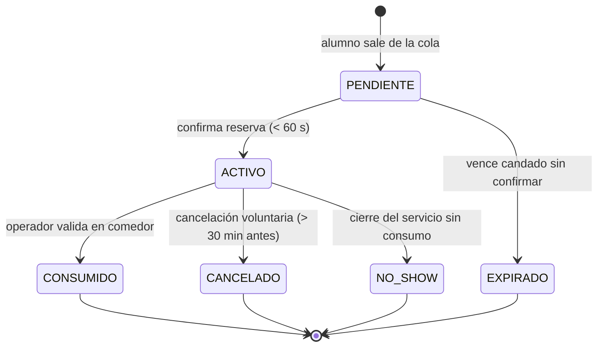
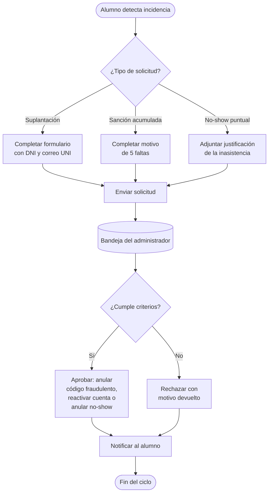
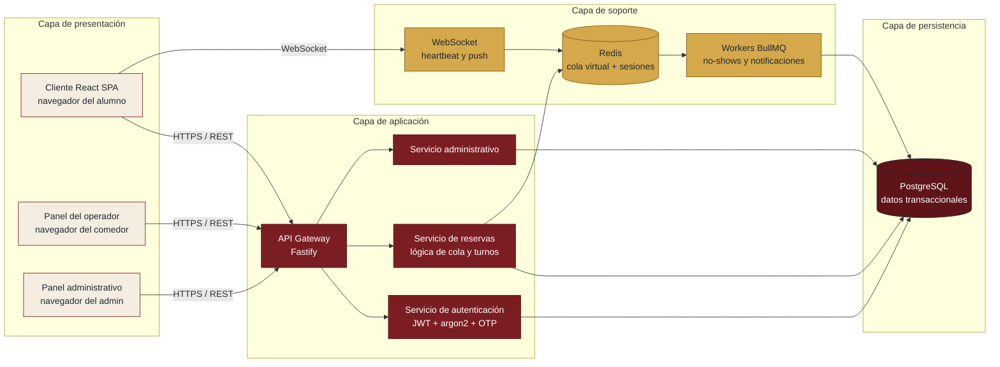
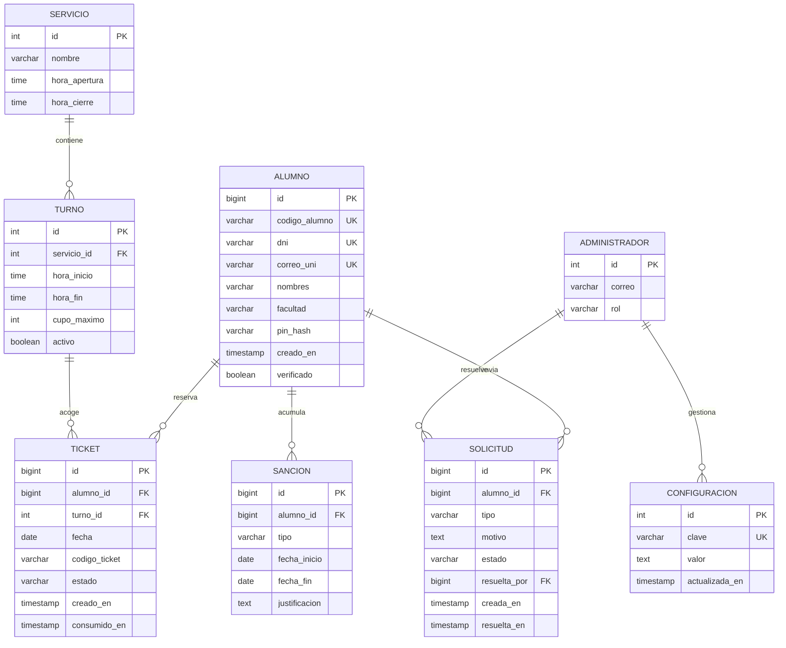
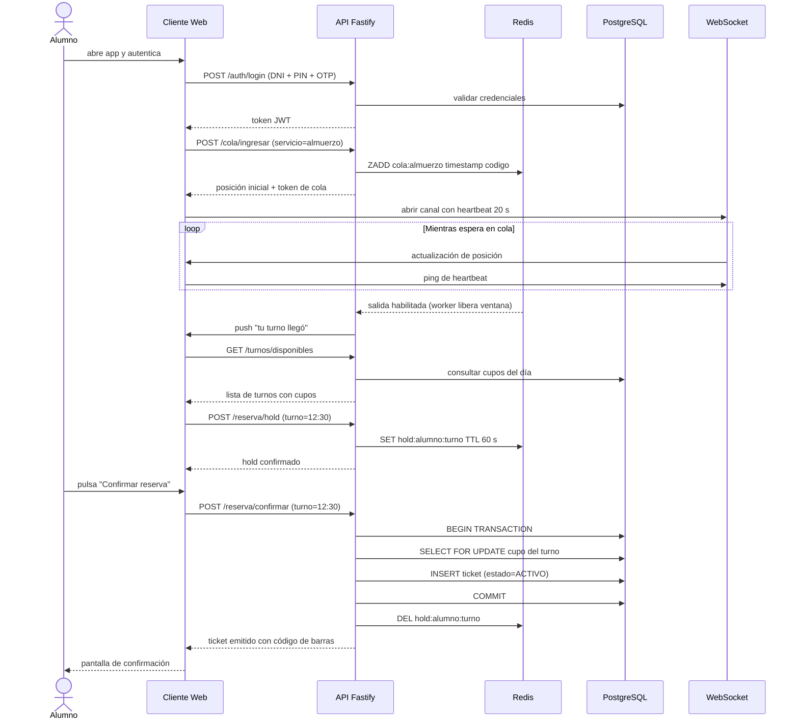
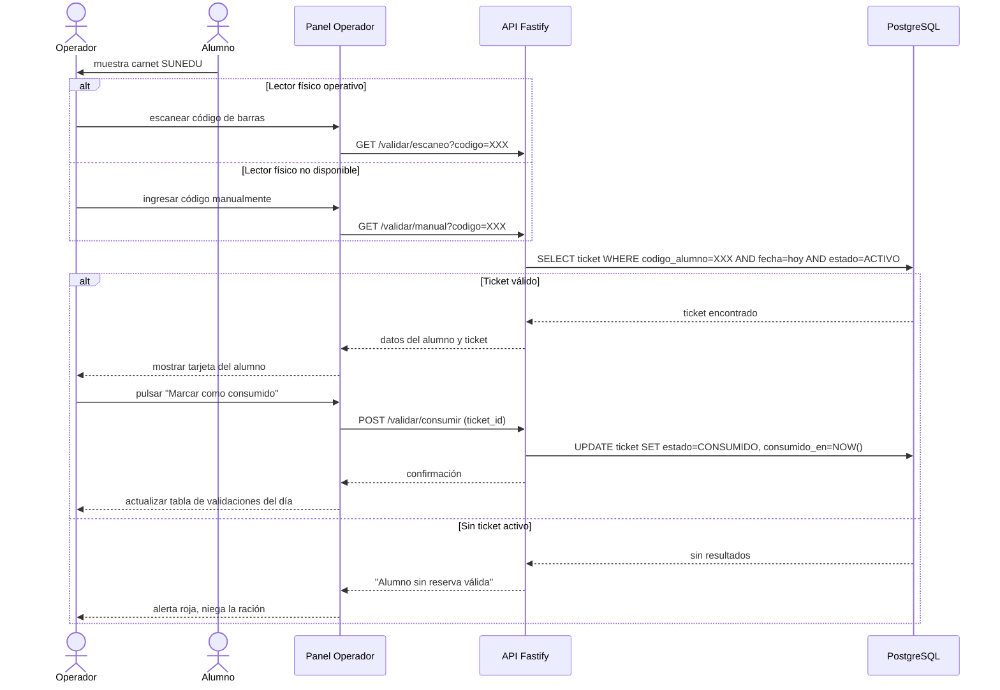
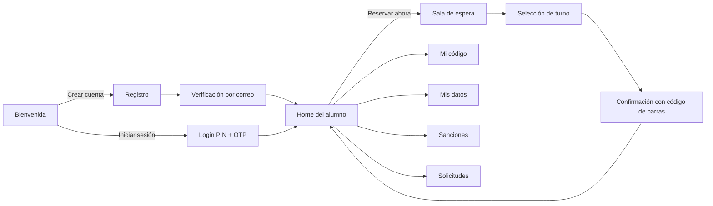

# 3.2 Diseño

El capítulo de diseño traduce los requerimientos consolidados en el apartado 3.1 hacia artefactos técnicos y visuales que permitan, en la fase posterior, implementar el sistema RanchUNI con una mínima divergencia respecto a lo documentado. Siguiendo la propuesta metodológica de Sommerville (2016), el diseño se descompone en tres planos complementarios: un diseño funcional centrado en el comportamiento observable del sistema, un diseño del sistema que define la estructura interna y las decisiones arquitectónicas, y un diseño de interfaz que materializa la interacción humano-máquina. Estos tres planos se articulan entre sí, de modo que una decisión tomada en el nivel funcional, como la necesidad de una sala de espera virtual, impacta tanto el modelo arquitectónico, que debe incorporar Redis y WebSocket, como la interfaz, que debe comunicar la posición en la cola y el tiempo estimado al usuario final. Los diagramas incluidos en el presente capítulo se presentan en notación Unified Modeling Language (UML) y en notación informal de bloques, redactados íntegramente en español y acompañados de una descripción textual paralela que preserva la información sustantiva aun cuando el diagrama no pueda renderizarse en el documento impreso (Booch et al., 2005).

## 3.2.1 Diseño funcional

El diseño funcional describe qué hace el sistema desde la perspectiva de sus usuarios finales, sin entrar en consideraciones tecnológicas. Para ello se identifican en primer lugar los actores que interactúan con la plataforma, luego el catálogo de casos de uso que representan sus objetivos dentro del sistema, y finalmente los modelos de comportamiento que gobiernan entidades críticas como el ticket y la solicitud administrativa. Esta sección adopta la perspectiva de casos de uso tal como la formaliza Cockburn (2001), quien propone centrar cada caso en la intención del actor y en la condición de éxito del objetivo, antes que en la secuencia de clics dentro de una interfaz particular.

### 3.2.1.1 Identificación de actores

El sistema RanchUNI reconoce tres actores humanos primarios y un actor secundario de naturaleza temporal. El primer actor es el alumno UNI regular, quien constituye el usuario masivo del sistema y cuyo objetivo principal consiste en asegurar una ración del comedor dentro de una franja horaria específica. El segundo actor es el operador del comedor, personal designado por la universidad para validar físicamente las raciones al momento del consumo, quien opera la aplicación desde una estación de trabajo conectada a un lector de códigos de barras. El tercer actor es el administrador del sistema, funcionario con privilegios elevados encargado de configurar parámetros operativos, revisar solicitudes y gestionar sanciones. El actor secundario es el planificador de tareas programadas, un componente no humano que dispara acciones periódicas como la marcación automática de no-shows al cierre de cada servicio, funcionalidad alineada con el patrón de programación diferida descrito por Microsoft Corporation (2023).

### 3.2.1.2 Catálogo general de casos de uso

El catálogo de casos de uso del sistema RanchUNI se presenta en el siguiente diagrama, el cual agrupa los casos por actor y por subsistema funcional.

```mermaid
graph TB
  subgraph Sistema["Sistema RanchUNI"]
    subgraph Acceso["Subsistema de acceso"]
      UC01(Registrar cuenta)
      UC02(Verificar correo UNI)
      UC03(Iniciar sesión con 2FA)
      UC04(Recuperar PIN)
    end
    subgraph Reserva["Subsistema de reserva"]
      UC05(Ingresar a sala de espera)
      UC06(Seleccionar turno)
      UC07(Confirmar reserva)
      UC08(Cancelar reserva)
    end
    subgraph Gestion["Subsistema de gestión"]
      UC09(Consultar mi código)
      UC10(Actualizar mis datos)
      UC11(Consultar sanciones)
      UC12(Enviar solicitud)
    end
    subgraph Operacion["Subsistema de operación"]
      UC13(Validar ticket)
      UC14(Registrar consumo)
    end
    subgraph Admin["Subsistema administrativo"]
      UC15(Configurar turnos y cupos)
      UC16(Resolver solicitudes)
      UC17(Gestionar sanciones)
      UC18(Visualizar reportes)
    end
  end
  Alumno((Alumno)) --> UC01
  Alumno --> UC02
  Alumno --> UC03
  Alumno --> UC04
  Alumno --> UC05
  Alumno --> UC06
  Alumno --> UC07
  Alumno --> UC08
  Alumno --> UC09
  Alumno --> UC10
  Alumno --> UC11
  Alumno --> UC12
  Operador((Operador)) --> UC13
  Operador --> UC14
  Administrador((Administrador)) --> UC15
  Administrador --> UC16
  Administrador --> UC17
  Administrador --> UC18
```

El diagrama organiza los dieciocho casos de uso del sistema en cinco subsistemas funcionalmente cohesivos. El subsistema de acceso reúne las interacciones del alumno con el módulo de identidad, desde el registro inicial con validación cruzada de código, DNI y correo institucional hasta la recuperación del PIN. El subsistema de reserva concentra el flujo principal del producto, el cual atraviesa la sala de espera virtual antes de permitir la selección atómica del turno. El subsistema de gestión recoge las acciones auxiliares del alumno sobre su propia cuenta, tales como la consulta del código de barras personal, la revisión de sanciones vigentes y el envío de solicitudes hacia la administración. El subsistema de operación describe la labor del operador del comedor durante el servicio, mientras que el subsistema administrativo congrega las actividades de configuración, arbitraje y análisis realizadas por el funcionario encargado. Esta separación por subsistemas facilita la posterior modularización del código y respalda la trazabilidad entre requerimientos y componentes (Sommerville, 2016).

### 3.2.1.3 Casos de uso principales

A continuación se describen en prosa los cuatro casos de uso considerados críticos para el éxito operativo del sistema, entendiéndose por críticos aquellos cuyo fallo compromete directamente el servicio de alimentación universitaria.

El caso de uso **Confirmar reserva (UC07)** representa la culminación del flujo principal y su correcto funcionamiento es determinante para la integridad del sistema. Tras superar la sala de espera virtual y seleccionar un turno específico, el alumno dispone de sesenta segundos para confirmar la reserva, ventana durante la cual el cupo permanece apartado mediante un candado virtual en memoria caché. Si el alumno confirma antes del vencimiento, el sistema verifica transaccionalmente que el cupo sigue disponible, que el alumno no posee otra reserva para el mismo día y servicio, y que no se encuentra bajo sanción activa. El resultado exitoso emite un ticket con estado ACTIVO y un código interno de referencia. La precondición es que el alumno haya pasado por la cola virtual, y la postcondición es la existencia de un registro único en la tabla de tickets que cumple el constraint UNIQUE(codigo_alumno, fecha, servicio). Los flujos alternativos contemplan vencimiento del candado, indisponibilidad súbita del cupo por condición de carrera resuelta por el sistema y rechazo por sanción activa.

El caso de uso **Validar ticket (UC13)** corresponde al momento presencial en el comedor universitario. El operador recibe al alumno, escanea el código de barras impreso en el carnet SUNEDU o, si el lector físico falla, ingresa manualmente el código de alumno en el panel operativo. El sistema responde mostrando los datos de identidad, la foto o avatar, el estado del ticket del día y la franja horaria asignada. Si el estado es ACTIVO y la hora actual se encuentra dentro de la ventana del turno, el operador pulsa la acción "Marcar como consumido" y el ticket transita a estado CONSUMIDO. La precondición operativa es que el servicio se encuentre en curso y que la jornada esté abierta. Los flujos alternativos contemplan tickets con estado distinto de ACTIVO, presentación fuera de ventana horaria permitida, o alumnos sin reserva, en cuyo caso se niega la ración.

El caso de uso **Configurar turnos y cupos (UC15)** concentra la parametrización operativa a cargo del administrador. Desde el panel administrativo el funcionario puede modificar la cantidad de turnos dentro de un servicio, ajustar los horarios de inicio y cierre de cada turno, alterar el cupo máximo por turno y establecer la hora de apertura de las reservas. Los cambios aplican al siguiente ciclo y no afectan reservas emitidas bajo la configuración anterior. Esta flexibilidad responde al requerimiento de adaptación frente a variaciones estacionales, paros académicos y eventos especiales, y se sustenta en el principio de configurabilidad expuesto por Pressman y Maxim (2019) como característica distintiva de los sistemas de software modernos.

El caso de uso **Resolver solicitudes (UC16)** constituye el canal de arbitraje humano dentro de un sistema ampliamente automatizado. El administrador accede a una bandeja de solicitudes pendientes, cada una de ellas clasificada por tipo: suplantación de código, levantamiento de sanción acumulada o anulación de un no-show puntual. Para cada solicitud el administrador revisa el motivo aducido, los datos de identidad, el historial de actividad del alumno y, en el caso de suplantación, compara los correos institucionales de las partes involucradas. La resolución puede ser de aprobación, con los efectos correspondientes sobre el sistema, o de rechazo con devolución motivada al alumno. Este caso materializa lo señalado por Saltzer y Schroeder (1975) respecto a que los sistemas computacionales deben reservar siempre una instancia de decisión humana para escenarios que los controles automáticos no pueden resolver unívocamente.

### 3.2.1.4 Máquina de estados del ticket

El ticket es la entidad central del sistema y su ciclo de vida está gobernado por una máquina de estados estricta. Cada transición obedece a un disparador identificado y no existen atajos entre estados no adyacentes. El siguiente diagrama formaliza este comportamiento.

El diagrama muestra que un ticket nace en estado PENDIENTE al momento en que el alumno sale de la sala de espera y dispone de sesenta segundos para concretar la reserva. Si la confirma dentro del plazo, el ticket pasa a ACTIVO; si no, el sistema lo marca como EXPIRADO y libera el cupo para otros alumnos. Desde ACTIVO existen tres salidas posibles: la validación presencial en el comedor lo convierte en CONSUMIDO, la cancelación voluntaria efectuada hasta treinta minutos antes del turno lo convierte en CANCELADO, y el cierre del servicio sin que el alumno se haya presentado lo marca automáticamente como NO_SHOW mediante un trabajo programado. Los estados CONSUMIDO, CANCELADO, EXPIRADO y NO_SHOW son terminales y no admiten transiciones ulteriores, garantizando inmutabilidad del registro histórico. Esta disciplina de estados asegura la consistencia de los reportes administrativos y evita condiciones de carrera que podrían provocar, por ejemplo, que un ticket sea validado y cancelado simultáneamente.

### 3.2.1.5 Flujo de solicitudes

Dado que ninguna automatización puede cubrir todos los escenarios de borde que se presentan en un entorno universitario real, el sistema dispone de un canal formal de solicitudes del alumno hacia la administración. El siguiente diagrama de actividad describe el ciclo de vida de una solicitud desde su envío hasta su resolución final.

El diagrama representa cómo, ante una incidencia, el alumno selecciona uno de los tres tipos de solicitud soportados por el sistema y completa el formulario correspondiente. Las tres variantes confluyen en la bandeja administrativa donde el funcionario encargado revisa caso por caso. La decisión derivada puede ser de aprobación, la cual dispara efectos automáticos sobre el sistema como anular el código alumno del perpetrador en el caso de suplantación, reactivar la cuenta suspendida en el caso de levantamiento de sanción, o descontar la falta del contador deslizante en el caso de anulación de no-show. Cualquiera sea el resultado, el alumno recibe una notificación por correo institucional con el motivo. Este flujo se diseña deliberadamente para mantener un registro auditable de cada intervención administrativa, en línea con el principio de accountability señalado por Saltzer y Schroeder (1975).

## 3.2.2 Diseño del sistema

El diseño del sistema traduce los casos de uso anteriores en una arquitectura técnica capaz de satisfacer los requerimientos no funcionales documentados en el apartado 3.1.2. La decisión arquitectónica rectora consiste en separar el sistema en una aplicación cliente de página única ejecutada en el navegador del alumno y una aplicación servidor que expone una interfaz de programación de aplicaciones, alojada en la infraestructura controlada por la universidad. Esta separación cliente-servidor se acompaña de cuatro servicios internos de apoyo: una base de datos relacional transaccional, una memoria caché con capacidades de estructuras de datos avanzadas, un sistema de mensajería asincrónica para la ejecución de trabajos programados y un canal de comunicación bidireccional persistente para las notificaciones en tiempo real. La elección de esta topología se fundamenta en el patrón reactivo descrito por Bonér et al. (2014), el cual sostiene que los sistemas modernos deben ser responsivos, resilientes, elásticos y orientados a mensajes.

### 3.2.2.1 Arquitectura por capas

El siguiente diagrama presenta la arquitectura general del sistema dividida en sus capas constituyentes y los flujos de comunicación entre componentes.

El diagrama distingue cuatro capas. La capa de presentación agrupa las tres aplicaciones cliente: el frontal del alumno orientado a dispositivo móvil, el panel del operador optimizado para pantalla de escritorio con lector de códigos de barras, y el panel administrativo también de escritorio con abundantes tablas y gráficos. La capa de aplicación contiene un único proceso servidor construido sobre Fastify que actúa como puerta de entrada y orquesta tres subservicios lógicos: autenticación, reservas y administración. La capa de soporte aloja Redis como memoria caché para la sala de espera virtual y el almacenamiento de sesiones, los workers de BullMQ encargados de ejecutar trabajos programados como la marcación diaria de no-shows, y el canal WebSocket responsable de los heartbeats de la cola y de las notificaciones en tiempo real hacia el cliente. La capa de persistencia está compuesta por un único servidor PostgreSQL que preserva los datos transaccionales críticos del sistema. Todos los componentes se despliegan como contenedores Docker orquestados por Docker Compose, lo cual facilita su reproducción en ambientes de desarrollo, pruebas y producción (Pressman y Maxim, 2019).

### 3.2.2.2 Modelo de datos

El modelo de datos del sistema se basa en un esquema relacional normalizado en tercera forma normal, consistente con el enfoque clásico descrito por Chen (1976) y ampliamente difundido por Silberschatz et al. (2019). El siguiente diagrama entidad-relación presenta las entidades principales y sus relaciones.

El modelo contempla siete entidades principales. La entidad Alumno almacena la identidad del usuario con tres campos marcados como clave única: código de alumno, DNI y correo UNI, reflejando la validación cruzada documentada en el apartado 3.1.3. La entidad Ticket concentra la lógica de reservas y sostiene el constraint crítico UNIQUE(alumno_id, fecha, turno_id), el cual garantiza a nivel de motor de base de datos que un mismo alumno no pueda poseer dos reservas simultáneas para el mismo servicio. Las entidades Servicio y Turno parametrizan la oferta diaria del comedor y pueden ser modificadas por el administrador sin afectar reservas preexistentes. Las entidades Solicitud y Sanción soportan el canal de arbitraje humano y la aplicación de medidas disciplinarias por inasistencia recurrente. Finalmente, la entidad Configuración almacena parámetros operativos del sistema como el cupo por defecto, la hora de apertura de reservas y las ventanas de cancelación, permitiendo modificarlos sin desplegar nuevo código (Fowler, 2003).

### 3.2.2.3 Secuencia de reserva en cola virtual

La secuencia de reserva constituye el flujo más complejo del sistema por su alto nivel de concurrencia. El siguiente diagrama presenta la interacción entre el cliente, el servidor y los servicios de soporte durante el proceso completo.

El diagrama comunica cuatro momentos diferenciados. En el primero el alumno se autentica mediante el esquema de doble factor compuesto por DNI, PIN hasheado con argon2 y contraseña de un solo uso enviada al correo institucional según el estándar RFC 6238 (M'Raihi et al., 2011). En el segundo, el cliente solicita ingreso a la sala de espera virtual, la cual es implementada como un Sorted Set de Redis donde cada alumno es insertado con su marca temporal de llegada como puntuación, garantizando ordenamiento First-In-First-Out. Mientras permanece en cola, el cliente mantiene abierto un canal WebSocket con latidos de actividad cada veinte segundos, lo cual permite al servidor detectar abandonos silenciosos y reasignar la posición. En el tercer momento, un worker externo habilita la salida del alumno conforme a la capacidad del sistema aguas abajo, y el servidor envía por el canal WebSocket la notificación correspondiente. En el cuarto y último momento, el alumno selecciona un turno y dispone de sesenta segundos para confirmar, ventana durante la cual el cupo queda reservado mediante un candado en Redis; la confirmación dispara una transacción sobre PostgreSQL que utiliza SELECT FOR UPDATE para serializar el acceso al contador de cupos, conforme al patrón descrito por Silberschatz et al. (2019) para el control de concurrencia pesimista.

### 3.2.2.4 Secuencia de validación en comedor

La secuencia de validación en el comedor es notoriamente más simple que la secuencia de reserva, aunque crítica para la operatividad diaria. Su complejidad radica en la necesidad de soportar un plan de contingencia cuando el lector físico de códigos de barras falla.

El diagrama contempla explícitamente la bifurcación técnica al inicio del flujo: cuando el lector físico de códigos de barras está operativo el operador simplemente acerca el carnet SUNEDU al dispositivo, y cuando no lo está ingresa manualmente el código de alumno en el campo correspondiente. Ambos caminos convergen en una consulta parametrizada que busca un ticket con estado ACTIVO para el alumno, la fecha del día y el servicio en curso. Si el ticket existe, el panel muestra los datos del alumno y el operador confirma la acción con un solo clic, tras lo cual el sistema transita el ticket a estado CONSUMIDO y actualiza la tabla de validaciones del día. Si el ticket no existe, el panel muestra una alerta roja que comunica inequívocamente al operador que debe negar la ración. Este diseño minimiza el tiempo de decisión del operador y reduce la probabilidad de errores humanos en un entorno de alta presión temporal, en línea con las recomendaciones de ergonomía cognitiva expuestas por Norman (2013).

### 3.2.2.5 Consideraciones de concurrencia y consistencia

La principal amenaza técnica del sistema es la condición de carrera que puede presentarse cuando múltiples alumnos compiten por el último cupo disponible de un turno. El diseño la resuelve mediante una estrategia de doble barrera. La primera barrera es la sala de espera virtual en Redis, la cual limita la cantidad de alumnos que pueden intentar reservar simultáneamente, reduciendo la presión sobre la base de datos (Microsoft Corporation, 2023). La segunda barrera es el bloqueo pesimista a nivel de fila sobre el contador de cupos del turno, implementado mediante la cláusula SELECT FOR UPDATE dentro de una transacción. Este bloqueo serializa el acceso al recurso compartido y garantiza que nunca se emitirán más tickets que cupos disponibles. Como refuerzo final, el motor PostgreSQL rechaza cualquier intento de insertar dos tickets para el mismo alumno, fecha y servicio gracias al constraint UNIQUE documentado en el modelo de datos. Esta defensa en profundidad implementa el patrón de exclusión mutua originalmente formalizado por Dijkstra (1965) y sigue vigente como fundamento del control de concurrencia en sistemas transaccionales (Silberschatz et al., 2019).

### 3.2.2.6 Consideraciones de seguridad

La arquitectura incorpora controles de seguridad en todas las capas conforme a las recomendaciones consolidadas por OWASP Foundation (2021). En la capa de red, toda comunicación se realiza bajo Transport Layer Security en versión 1.3 (Rescorla, 2018), lo cual garantiza la confidencialidad e integridad de los datos en tránsito. En la capa de aplicación, la autenticación combina tres factores: DNI como identificador público, PIN de seis dígitos hasheado con el algoritmo argon2id como factor de conocimiento, y contraseña de un solo uso entregada al correo institucional como factor de posesión (Grassi et al., 2017). En la capa de datos, el acceso se restringe mediante roles de base de datos específicos por servicio y las consultas utilizan parámetros preparados para eliminar vectores de inyección. Finalmente, un rate limiter distribuido en Redis aplica bloqueo exponencial por dirección IP y por DNI, activando un CAPTCHA al tercer intento fallido, lo cual mitiga los ataques de fuerza bruta sobre el PIN.

## 3.2.3 Diseño de interfaz

El diseño de interfaz del sistema RanchUNI se sustenta en cuatro principios rectores destilados de la literatura clásica de usabilidad. El primero es la visibilidad del estado del sistema, principio enunciado por Nielsen (1994), según el cual la interfaz debe comunicar al usuario en todo momento qué está sucediendo, aplicándose de manera especial en la sala de espera virtual donde la posición en cola y el tiempo estimado son elementos permanentemente visibles. El segundo principio es el de minimización de la carga cognitiva propuesto por Norman (2013), el cual se traduce en una jerarquía visual clara donde una única acción primaria destaca por pantalla, evitando que el alumno se vea abrumado por opciones paralelas. El tercer principio es el de consistencia, a fin de que las metáforas visuales se repitan entre pantallas y entre módulos del sistema. El cuarto principio es el de accesibilidad, alineado con las pautas del consorcio World Wide Web (World Wide Web Consortium, 2018), el cual exige contraste suficiente entre texto y fondo, tamaños tipográficos mínimos y navegación operable mediante teclado en los dashboards del staff.

### 3.2.3.1 Sistema visual

El sistema visual adopta la paleta institucional de la Universidad Nacional de Ingeniería como base cromática, con granate oscuro (#7B1E23) como color primario asociado a las acciones positivas y a los encabezados de navegación, dorado (#D4A84B) como color secundario empleado para acentos y estados de atención, y crema (#F5EDE0) como color terciario utilizado en fondos de alta legibilidad. El esquema se complementa con tonos funcionales estándar: verde para confirmaciones, ámbar para advertencias y rojo para errores o sanciones. La tipografía elegida es Inter en pesos 400, 500, 600, 700 y 800, seleccionada por su alta legibilidad en pantallas de pequeño tamaño y por su carácter neutro que evita asociaciones emocionales no intencionadas. El sistema de espaciado sigue una retícula de ocho píxeles y las esquinas redondeadas mantienen un radio consistente de diez a dieciocho píxeles según el componente.

### 3.2.3.2 Mapa de navegación

La aplicación se organiza en cuatro grupos de pantallas correspondientes a los cuatro momentos funcionales identificados en la sección anterior. El siguiente diagrama representa la navegación principal del alumno desde el primer contacto con la aplicación hasta la gestión de su cuenta.

El diagrama muestra que el alumno ingresa a la aplicación por la pantalla de bienvenida, desde la cual puede optar por crear una cuenta nueva o iniciar sesión con una existente. Tras la autenticación exitosa accede al home, nodo central de la experiencia desde el cual se ramifican dos grupos de acciones: por un lado el flujo de reserva, consistente en cola, selección y confirmación; por otro, los módulos de gestión de cuenta, a saber, consulta del código personal, actualización de datos editables, consulta de sanciones y envío de solicitudes administrativas. Esta estructura mantiene la profundidad de navegación en un máximo de tres niveles, en línea con las recomendaciones de Krug (2014) sobre economía de clics en interfaces orientadas a tareas breves.

### 3.2.3.3 Descripción de las vistas del alumno

Las vistas móviles del alumno se detallan a continuación, acompañadas de las reglas de interacción aplicables. La materialización visual de cada una se encuentra en el catálogo de mockups ubicado en la carpeta `Avances/Diseño_mockups/`.

La **pantalla de bienvenida** funciona como primera impresión de la marca. Ocupa toda la altura útil del dispositivo con un fondo granate oscuro degradado hacia un tono más profundo, con el logotipo institucional centrado dentro de un contenedor blanco de esquinas redondeadas y el nombre "RanchUNI" escrito en gran tamaño con acento dorado en el sufijo "UNI". Bajo la sección visual se presentan dos botones de idéntica jerarquía: "Iniciar sesión" con estilo lleno y "Crear cuenta" con estilo de contorno, respetando la convención de priorizar la acción más frecuente mediante un peso visual superior.

La **pantalla de registro** solicita cinco campos ordenados por primacía: código de alumno, nombres completos, DNI, correo UNI y facultad. Cada campo se valida localmente en formato antes del envío y el sistema ejecuta las validaciones cruzadas del lado del servidor. Se incluye un aviso informativo de color azul que advierte sobre la unicidad del código de alumno y la existencia del canal de solicitudes por suplantación, comunicando proactivamente al usuario el mecanismo disponible ante eventuales disputas.

La **pantalla de login** adopta el esquema visual de Yape, ampliamente reconocido por la población peruana objetivo. Presenta un encabezado granate con el DNI parcialmente ocultado y una tarjeta inferior con los seis puntos del PIN y un teclado numérico dispuesto en cuadrícula de tres por cuatro. El tercer botón de la última fila se reserva para la huella dactilar cuando el dispositivo la soporta, promoviendo la adopción de factores biométricos como complemento al PIN.

La **pantalla home del alumno** implementa el patrón de cuadrícula con acción principal destacada. En el encabezado granate aparece un saludo personalizado con el nombre del alumno y un icono de notificaciones. Inmediatamente debajo, y superponiéndose parcialmente al encabezado, se encuentra una tarjeta blanca con borde lateral dorado que contiene la llamada a la acción principal "Reservar almuerzo" junto con el estado de la ventana de reservas. El resto de la pantalla se organiza en una cuadrícula de tres columnas con seis accesos secundarios: Mi código, Mis datos, Sanciones, Solicitudes, Cerrar sesión y Eliminar cuenta, cada uno representado por un icono sobre un fondo cromático distintivo que facilita el reconocimiento rápido.

La **pantalla de sala de espera virtual** se centra en dos elementos informativos de gran formato: el número de posición en cola escrito en tipografía de sesenta y cuatro píxeles y el tiempo estimado de espera. Una barra de progreso horizontal complementa la información cuantitativa con una representación visual del avance. Un punto verde con animación de pulso etiquetado "Conexión activa" confirma al alumno que el canal WebSocket permanece saludable y que su posición en cola está siendo mantenida por el servidor.

La **pantalla de selección de turno** muestra en la parte superior un cronómetro regresivo de cinco minutos con color de fondo dorado, cuya función es tanto informativa como motivacional. La pestaña "Almuerzo" o "Cena" se selecciona según el servicio en curso. Cada turno se lista con su horario, una barra fina de ocupación, el contador de cupos disponibles y una insignia de estado con código de color: verde para disponibilidad holgada, ámbar para cupos limitados y rojo para turnos llenos. Los turnos sin cupos aparecen atenuados y no pueden ser seleccionados, implementando el principio de restricciones visibles descrito por Norman (2013).

La **pantalla de confirmación de reserva** reemplaza la combinación ticket-QR originalmente contemplada por una representación directa del código de alumno en formato de código de barras impreso, acompañado de los ocho dígitos legibles debajo. Este cambio de diseño responde a la decisión funcional de reutilizar la identidad oficial del alumno, presente en el carnet SUNEDU, como artefacto de validación en el comedor, eliminando la necesidad de mantener un código de ticket intermedio como vector primario.

La **pantalla Mi código** constituye la vista estándar del código de barras personal, accesible desde el home y pensada para situaciones en que el carnet SUNEDU físico no esté disponible. La tarjeta muestra el código de barras de gran tamaño, los ocho dígitos del código de alumno, los nombres completos y la facultad, rodeada por un borde dorado que la distingue visualmente como elemento de alta importancia.

La **pantalla Mis datos** separa visualmente los campos bloqueados de los editables. Los campos código de alumno, DNI y nombres se presentan con un icono de candado y fondo atenuado, comunicando inequívocamente que su modificación corresponde a la administración mediante el canal de solicitudes. Los campos editables son correo UNI, facultad y PIN, ordenados de menor a mayor sensibilidad.

La **pantalla Sanciones** aloja un panel superior con el contador de inasistencias en la ventana deslizante de treinta días y una representación gráfica del umbral mediante tres puntos horizontales que se colorean progresivamente. Debajo del panel se lista cada inasistencia registrada con fecha, servicio y código del ticket afectado. Un recuadro final resume la política de sanciones vigente: dos faltas gatillan advertencia, tres faltas aplican suspensión de siete días y cinco faltas acumuladas activan suspensión hasta que medie solicitud manual.

La **pantalla Solicitudes** se divide en dos subsecciones. La primera lista las solicitudes en curso del alumno con su estado correspondiente. La segunda ofrece los tres tipos de solicitud disponibles representados como tarjetas con icono diferenciado: suplantación de código con simbología de escudo, levantamiento de sanción con flecha circular y anulación de no-show con flecha de retorno. Al pulsar cualquier tarjeta el sistema abre el formulario específico del tipo seleccionado.

### 3.2.3.4 Descripción de las vistas del staff

Las vistas del staff se diseñan para pantalla de escritorio, asumiendo un entorno laboral estable con teclado completo, monitor de al menos catorce pulgadas y dispositivos auxiliares como el lector de códigos de barras en el caso del operador.

El **panel del operador** prioriza la velocidad de validación. Se organiza en dos columnas: a la izquierda, un campo de escaneo con borde discontinuo granate y una caja de ingreso manual de respaldo; a la derecha, la ficha del último alumno validado con su nombre, código, facultad, insignia de validez y cuatro campos clave del ticket. En la parte inferior se presenta una tabla cronológica con las últimas validaciones del turno, que permite al operador revertir una validación reciente en caso de error y que sirve además como registro visible de la actividad.

El **dashboard administrativo** adopta el patrón clásico de aplicaciones empresariales: una barra lateral izquierda granate con navegación por módulos, y un área central donde se cargan las distintas vistas. La vista inicial de panel presenta cuatro indicadores clave del día, dos gráficos de demanda y una tabla de configuración de turnos directamente editable. El administrador puede modificar los cupos de cada turno presionando el valor numérico y confirmando el cambio, lo cual materializa la flexibilidad operativa requerida en el caso de uso UC15.

### 3.2.3.5 Accesibilidad y responsividad

La aplicación del alumno sigue el enfoque mobile-first de diseño, partiendo de un viewport base de 360 píxeles de ancho y escalando progresivamente hacia tabletas mediante grillas flexibles. El contraste mínimo entre texto y fondo cumple el nivel doble A de las Web Content Accessibility Guidelines (World Wide Web Consortium, 2018), verificable en los pares granate sobre blanco y blanco sobre granate empleados mayoritariamente en el sistema. Los destinos táctiles mantienen un tamaño mínimo de cuarenta y cuatro píxeles en el lado menor, conforme a las recomendaciones de Apple y Google para interfaces móviles. Los dashboards del staff, por su naturaleza, son desktop-first y se optimizan para resoluciones iguales o superiores a 1280 por 720 píxeles, con navegación íntegramente operable por teclado para facilitar el uso prolongado sin fatiga del brazo derecho.

---

## Resumen del capítulo

El capítulo 3.2 consolida el diseño del sistema RanchUNI en tres planos complementarios. El diseño funcional identifica tres actores humanos, formaliza dieciocho casos de uso agrupados en cinco subsistemas, describe con detalle los cuatro casos críticos, modela el ciclo de vida del ticket mediante una máquina de estados estricta y formaliza el flujo administrativo de solicitudes. El diseño del sistema define una arquitectura por capas con cliente React, API Fastify, PostgreSQL, Redis, workers BullMQ y canal WebSocket, especifica un modelo de datos normalizado en siete entidades con un constraint de unicidad crítico, describe la secuencia concurrente de reserva y la secuencia de validación con plan B manual, y establece controles de concurrencia y seguridad conforme a estándares reconocidos. El diseño de interfaz articula principios de usabilidad y accesibilidad, adopta la paleta institucional UNI con acentos dorados, define un mapa de navegación máximo de tres niveles y describe detalladamente las trece vistas del sistema agrupadas por flujo funcional. El capítulo referencia permanentemente el catálogo visual disponible en la ruta `Avances/Diseño_mockups/` como material de apoyo para la implementación de la fase siguiente.
