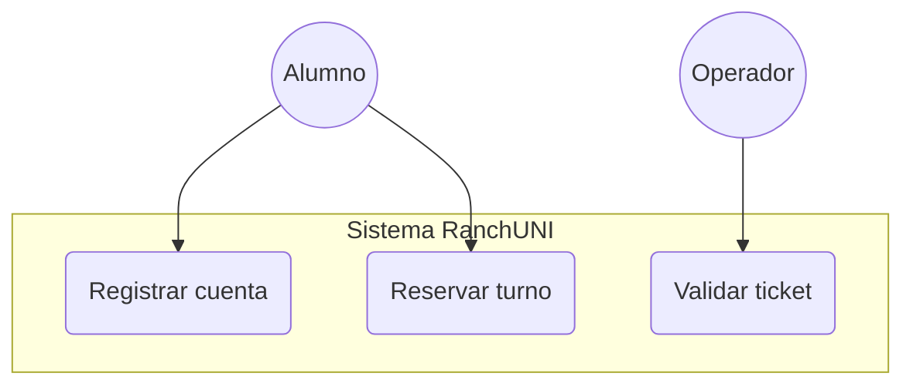
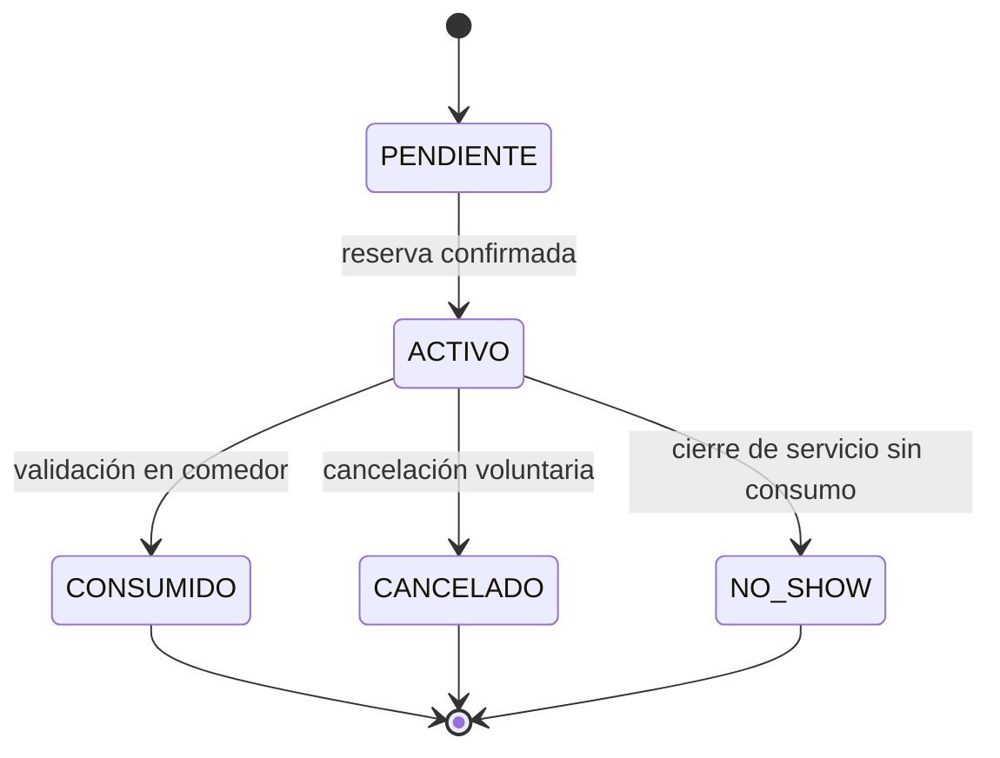
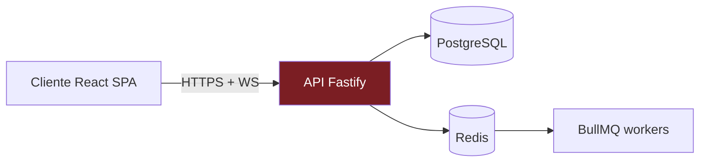
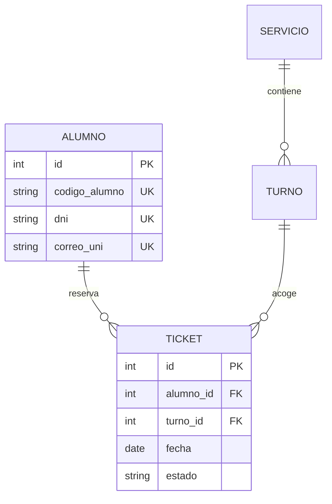
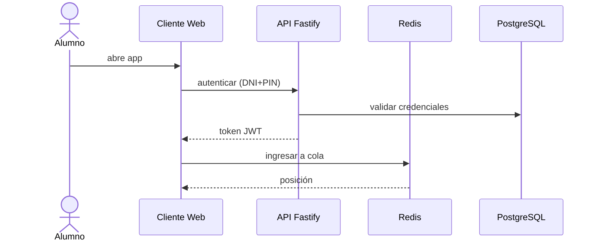
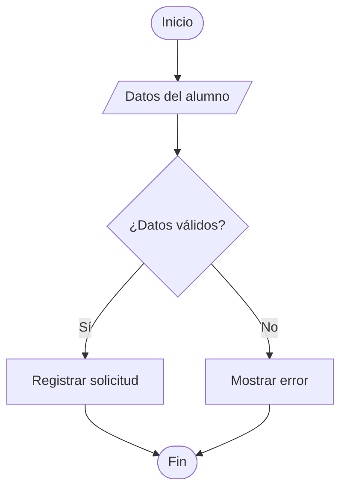

Todos los diagramas Mermaid deben escribirse en español: etiquetas de actores, estados, relaciones, notas y títulos. Evitar inglés salvo tecnicismos intraducibles (API, JWT, WebSocket, CRUD, CAPTCHA, OTP).

Cada diagrama va como bloque ```mermaid dentro del .md y se acompaña de un párrafo descriptivo (2-5 oraciones) para que el documento final en docx conserve la información aunque el renderizador Mermaid falle.

Usar la paleta UNI para styling cuando Mermaid lo permita: granate `#7B1E23`, granate oscuro `#5E1418`, dorado `#D4A84B`, crema `#F5EDE0`, texto `#1F2937`. Para fondos claros preferir `#F5EDE0`. Para estados críticos usar rojo `#DC2626`.

Convenciones de nombres: actores en PascalCase español (Alumno, Operador, Admin). Casos de uso como verbos en infinitivo (Registrar cuenta, Reservar turno, Validar ticket). Estados en mayúsculas con guion bajo (PENDIENTE, ACTIVO, CONSUMIDO, EXPIRADO, CANCELADO, NO_SHOW). Entidades de BD en singular PascalCase (Alumno, Ticket, Servicio, Turno).

Plantilla de casos de uso (graph TB con subgraph por sistema):


Plantilla de máquina de estados (stateDiagram-v2):


Plantilla de arquitectura por capas (graph LR con estilos):


Plantilla ER (erDiagram):


Plantilla de secuencia (sequenceDiagram):


Plantilla de flujo/actividad (graph TD):


Reglas duras al generar diagramas para monografía:
- Nunca escribir nombres de archivos de código, clases JavaScript/Python ni sintaxis de lenguajes de programación dentro de los nodos. La monografía no lleva código.
- Los nombres técnicos de tecnologías (Fastify, Prisma, BullMQ, JWT) sí se pueden mencionar en nodos de arquitectura porque son nombres propios del producto/estándar.
- Etiquetas de flechas y transiciones siempre en español.
- Máximo 12 nodos por diagrama para mantener legibilidad en una página A4 vertical.
- Si un diagrama necesita más de 12 nodos, dividirlo en dos con títulos distintos.

Cada bloque Mermaid debe acompañarse, en la misma sección del .md, de un párrafo que describa el diagrama en prosa académica: qué representa, qué actores o elementos participan, y qué conclusión operativa se extrae. Este párrafo es el que sobrevivirá en el docx final incluso si el usuario decide no exportar la imagen del diagrama.
